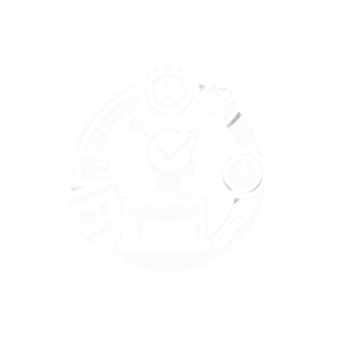
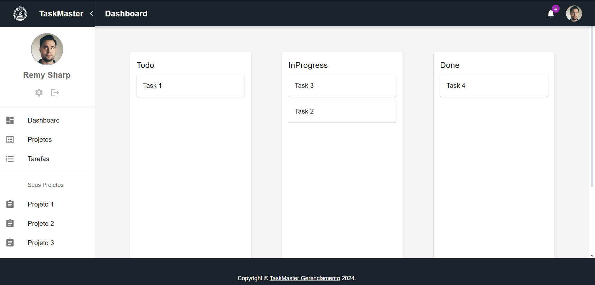
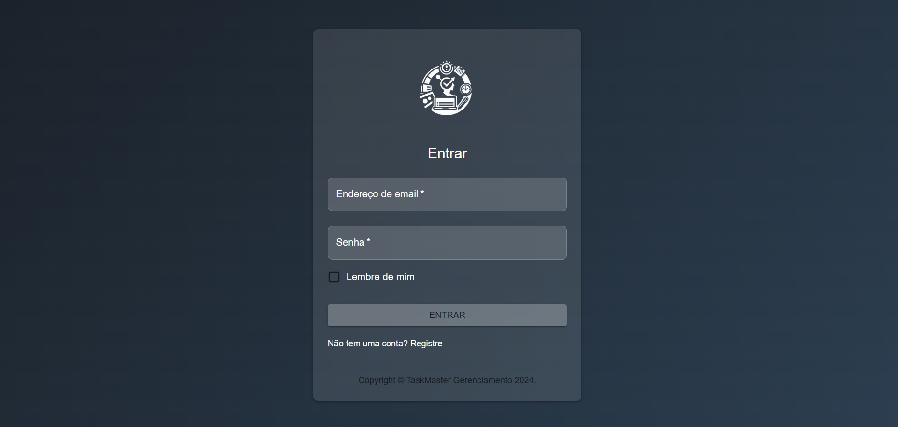
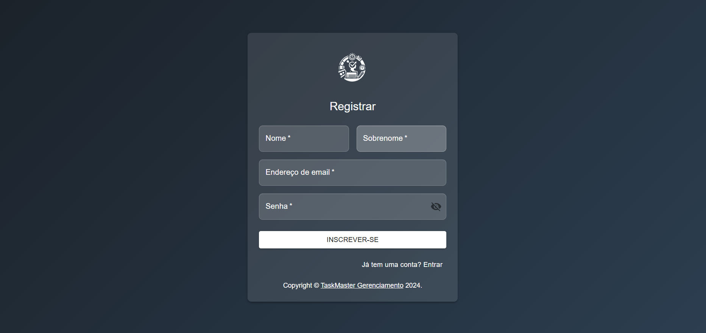
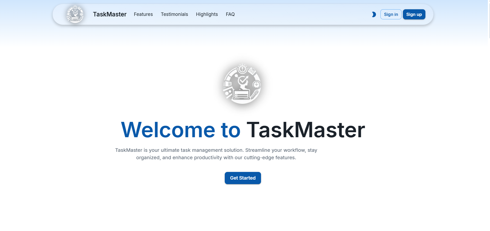

<p align="center">
  
</p>
<h3 align = "center" fontSize="60px">
  Task Management App aplicativo fullstack de gerenciamento de tarefas
</h3>

<p align="center">
  
  <h3 align = "center" fontSize="60px">
  Versão Previa(Em desenvolvimento)
  </h3>
</p>

# Task Management App

## 💻 Descrição

Este aplicativo fullstack de gerenciamento de tarefas é uma demonstração do meu progresso na aplicação de tecnologias modernas de desenvolvimento web. No desenvolvimento deste projeto, estou explorando e aprimorando minhas habilidades nas seguintes áreas:

- React.js: Utilizado para criar uma interface de usuário dinâmica e responsiva, com o objetivo de melhorar a experiência do usuário e a interação com a aplicação.
- NestJS: Implementado para construir uma API de back-end robusta e escalável, proporcionando uma base sólida para a manipulação de dados e lógica de negócios.
- PostgreSQL: Escolhido para o armazenamento de dados, com o intuito de garantir eficiência e confiabilidade no gerenciamento e recuperação de informações.
- Docker: Utilizado para conteinerização, facilitando a implantação contínua e a gestão de ambientes de desenvolvimento e produção.

Estou constantemente aprendendo e aplicando novas técnicas e boas práticas para otimizar a performance e a escalabilidade do aplicativo. Este projeto não apenas me permite explorar novas tecnologias, mas também me desafia a resolver problemas complexos e a melhorar minhas habilidades de desenvolvimento.

## 📊 Progresso do Projeto

### Progresso Total

- **Progresso Total**: 30% concluído
- **Descrição**: 
1. Implementação inicial concluída, estrutura básica do projeto configurada.
### Frontend

- **Frontend**: 25% concluído
- **Descrição**: 
1. Estrutura do frontend configurada, começando a implementação dos componentes principais
2. Criação das telas de login,cadastro e tela do dashboard com o kanban inicial
### Backend

- **Backend**: 5% concluído
- **Descrição**: 
1. Estrutura básica do backend configurada, início da implementação da API e integração com o banco de dados.
---
### Próximos Passos

- **Frontend**:
  - Desenvolver páginas adicionais.
  - Integrar com a API do backend.
- **Backend**:
  - Completar endpoints da API.
  - Implementar autenticação e autorização.
- **Progresso Total**:
  - Refinar a estrutura do projeto.
  - Realizar testes e ajustes conforme necessário.

## 🎨 Tecnologias Utilizadas

### Frontend
- **React**: Biblioteca JavaScript para construção de interfaces de usuário.
- **Material-UI**: Biblioteca de componentes React para um design moderno e responsivo.
- **Axios**: Cliente HTTP para fazer requisições à API.

### Backend
- **NestJS**: Framework Node.js para construção de aplicações server-side escaláveis.
- **TypeORM**: ORM para TypeScript e JavaScript (ES7, ES6, ES5).
- **JWT**: Mecanismo para autenticação segura usando tokens JSON Web.
- **Class-Validator**: Biblioteca para validação de objetos e propriedades.
- **Class-Transformer**: Biblioteca para transformar objetos em classes e vice-versa. 


### Banco de Dados
- **PostgreSQL**: Sistema de gerenciamento de banco de dados relacional poderoso e open-source.

### DevOps
- **Docker**: Plataforma para desenvolvimento, envio e execução de aplicações em containers.
- **Docker Compose**: Ferramenta para definir e gerenciar multi-containers Docker.
- **Adminer**: Ferramenta de gerenciamento de banco de dados com uma interface de usuário amigável.


### Design e Modelagem
- **dbDesigner**: Ferramenta online para modelagem de banco de dados ER.
- **Figma**: Ferramenta para design de interface e prototipagem colaborativa.

## Funcionalidades

- [ ] Autenticação e autorização de usuários na manipulação das tarefas de projetos
- [ ] CRUD de tarefas
- [ ] Gestão de projetos

## Estrutura do Projeto

- backend/: API NestJS
- frontend/: Aplicação React.js
- database/: Configuração do PostgreSQL

## Como Executar o Projeto

### Pré-requisitos
- Docker
- Docker Compose

### Passos para Clonar e Configurar
```bash
git clone https://github.com/Sub-Dev/task-management-app.git
cd task-management-app
```
### Instruções para Executar com Docker
```bash
docker-compose up --build
```
## Acessar o Adminer

Depois que o Docker Compose estiver em execução, você pode acessar o Adminer para gerenciar seu banco de dados PostgreSQL navegando até:
```bash
http://localhost:8080
```
## Endpoints da API
A API estará disponível em:
```bash
http://localhost:4000
```
## Aplicação Frontend
A aplicação frontend estará disponível em:
```bash
http://localhost:3000
```
## Adicionando Dependências (ate o momento)
### Backend (NestJS)
O backend NestJS inclui algumas das seguintes dependências adicionais alem do pg driver PostgreSQL para o Node.js e typeorm ORM para TypeScript e JavaScript:
- **Class-Validator**: Para validar DTOs (Data Transfer Objects).
- **Class-Transformer**: Para transformar objetos em classes e vice-versa.
Conferir demais dependências no package.json do backend.

Para instalar essas dependências, você pode usar os comandos abaixo:
```bash
npm install @nestjs/class-validator @nestjs/class-transformer
```
### Frontend (React.js)

Foram criados as telas de login,cadastro,homepage e também do dashboard com o kanban inicial do projeto em desenvolvimento como nas imagens abaixo:

<p align="center">
    
  
  
  
</p>

## 👥 Autor

<table>
 <tr>
 <td alinhar="centro">
 <a href="https://github.com/Sub-Dev" target="_blank">
 
 </a>
 </td>
 <td>
 <strong>Anthony Marin</strong> (Sub-Dev) - <a href="https://github.com/Sub-Dev">Perfil no GitHub</a>
 </td>
 </tr>
</table>

## Licença
Este projeto está licenciado sob a Licença MIT.


