<p align="center">
  
</p>
<h3 align = "center" fontSize="60px">
  Task Management App aplicativo fullstack de gerenciamento de tarefas
</h3>

<p align="center">
  <h3 align = "center" fontSize="60px">
    Task Management App DEMO
  </h3>
  
  
</p>

<h3 align="center" style="font-size: 60px;">
  Task Management App Imagens (Mais imagens no final do README)
</h3>

<table>
  <tr>
    <td>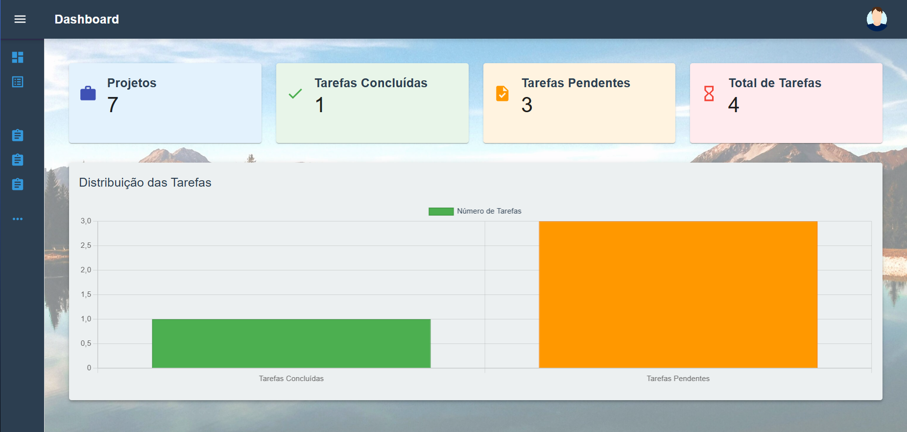</td>
    <td>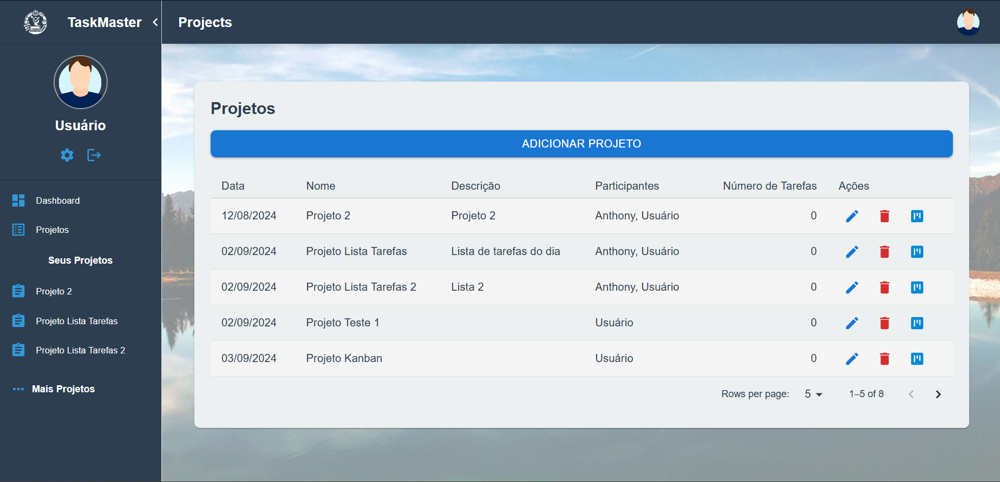</td>
    <td>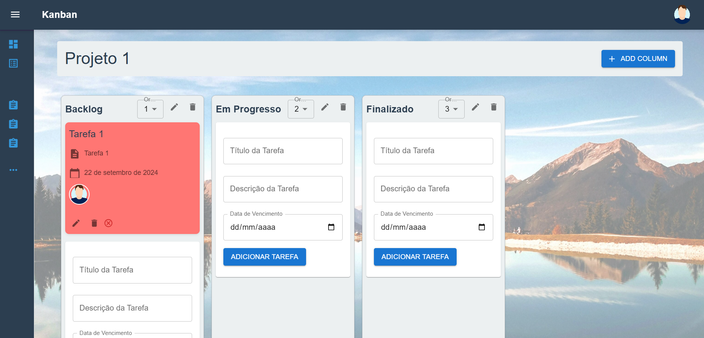</td>
  </tr>
</table>

# Task Management App

## 💻 Descrição

Este aplicativo fullstack de gerenciamento de tarefas é uma demonstração do meu progresso na aplicação de tecnologias modernas de desenvolvimento web. No desenvolvimento deste projeto, estou explorando e aprimorando minhas habilidades nas seguintes áreas se utilizando das seguintes tecnologias para o desenvolver da aplicação:

-   
  Utilizado para criar uma interface de usuário dinâmica e responsiva, com o objetivo de melhorar a experiência do usuário e a interação com a aplicação.

-   
  Implementado para construir uma API de back-end robusta e escalável, proporcionando uma base sólida para a manipulação de dados e lógica de negócios.

-   
  Escolhido para o armazenamento de dados, com o intuito de garantir eficiência e confiabilidade no gerenciamento e recuperação de informações.

-   
  Utilizado para conteinerização, facilitando a implantação contínua e a gestão de ambientes de desenvolvimento e produção.

-   
  Integrado para cache melhorando a performance do aplicativo e a eficiência no armazenamento temporário de dados.

-   
  Utilizado no Kanban board para permitir a funcionalidade de arrastar e soltar tarefas, proporcionando uma experiência interativa e intuitiva.

-   
  Implementado para criar gráficos e visualizações de dados, permitindo a apresentação visual de métricas e estatísticas relacionadas ao gerenciamento de tarefas.

-   
  Utilizado para fazer requisições HTTP à API, facilitando a comunicação entre o frontend e o backend.

-   
  Implementado para autenticação segura e gerenciamento de sessões de usuário, garantindo que os usuários estejam autenticados e autorizados a acessar recursos protegidos.

-   
  Utilizado para documentar e testar os endpoints da API, facilitando a interação com a documentação da API e melhorando a compreensão dos recursos disponíveis.

- 
  Ferramenta de gerenciamento de banco de dados com uma interface de usuário amigável.

Estou constantemente aprendendo e aplicando novas técnicas e boas práticas para otimizar a performance e a escalabilidade do aplicativo. Este projeto não apenas me permite explorar novas tecnologias, mas também me desafia a resolver problemas complexos e a melhorar minhas habilidades de desenvolvimento.

## 📊 Progresso do Projeto

### Progresso Total


- **Progresso Total**: 100% concluído
- **Descrição**:
  1. Implementação inicial concluída, estrutura básica do projeto configurada.
  2. Configurações básicas do frontend e backend finalizadas.
  3. Implementação de funcionalidades básicas concluída.
  4. Página Home do frontend completa.
  5. Endpoints do backend em funcionamento.
  6. Implementação de funcionalidades como CRUD de tarefas e autenticação de usuários.
  7. Configuração do banco de dados PostgreSQL utilizando Docker.
  8. Criação da estrutura básica do frontend com React.js e Material-UI.
  9. Ajustes finais implementados.

### Frontend


- **Frontend**: 100% concluído
- **Descrição**:
  1. Estrutura do frontend configurada, começando a implementação dos componentes principais.
  2. Criação das telas de login, cadastro e dashboard com o Kanban inicial.
  3. Desenvolvimento de componentes principais, como Header e Footer.
  4. Integração do Kanban com as funcionalidades de arrastar e soltar utilizando React Beautiful DnD.
  5. Implementação de gráficos e visualizações de dados com React-chartjs-2.

### Backend


- **Backend**: 100% concluído
- **Descrição**:
  1. Estrutura básica do backend configurada, com início da implementação da API e integração com o banco de dados.
  2. Configuração do JWT para autenticação segura, incluindo login e cadastro de usuários.
  3. Finalização do CRUD básico para usuários, tarefas, colunas e projetos, com endpoints devidamente configurados.
  4. Implementação da API utilizando NestJS e TypeORM.
  5. Criação de endpoints para CRUD de tarefas e autenticação de usuários.
  6. Configuração completa do JWT para autenticação segura.
  7. Implementação de validação de objetos e propriedades com Class-Validator e Class-Transformer.
  8. Adição do Swagger para documentação da API, permitindo testes interativos dos endpoints.
  9. Integração do Redis para cache.

## 🎨 Tecnologias Utilizadas

### 🌐 Frontend

- 
  Biblioteca JavaScript para construção de interfaces de usuário dinâmicas e responsivas.

- 
  Biblioteca de componentes React para um design moderno e responsivo.

- 
  Cliente HTTP para fazer requisições à API.

-   
   Utilizado no Kanban board para permitir a funcionalidade de arrastar e soltar tarefas, proporcionando uma experiência interativa e intuitiva.

-   
  Implementado para criar gráficos e visualizações de dados, permitindo a apresentação visual de métricas e estatísticas relacionadas ao gerenciamento de tarefas.

---

### ⚙️ Backend

- 
  Framework Node.js para construção de aplicações server-side escaláveis.

- 
  ORM para TypeScript e JavaScript (ES7, ES6, ES5).

- 
  Mecanismo para autenticação segura usando tokens JSON Web.

- 
  Biblioteca para validação de objetos e propriedades.

- 
  Biblioteca para transformar objetos em classes e vice-versa.

- 
  Ferramenta para documentação e teste de APIs RESTful.

- 
  Sistema de armazenamento em memória para cache e gerenciamento de sessões.

---

### 🗄️ Banco de Dados

- 
  Sistema de gerenciamento de banco de dados relacional poderoso e open-source.

#### 🗄️ Modelo ER

<p align="center">
  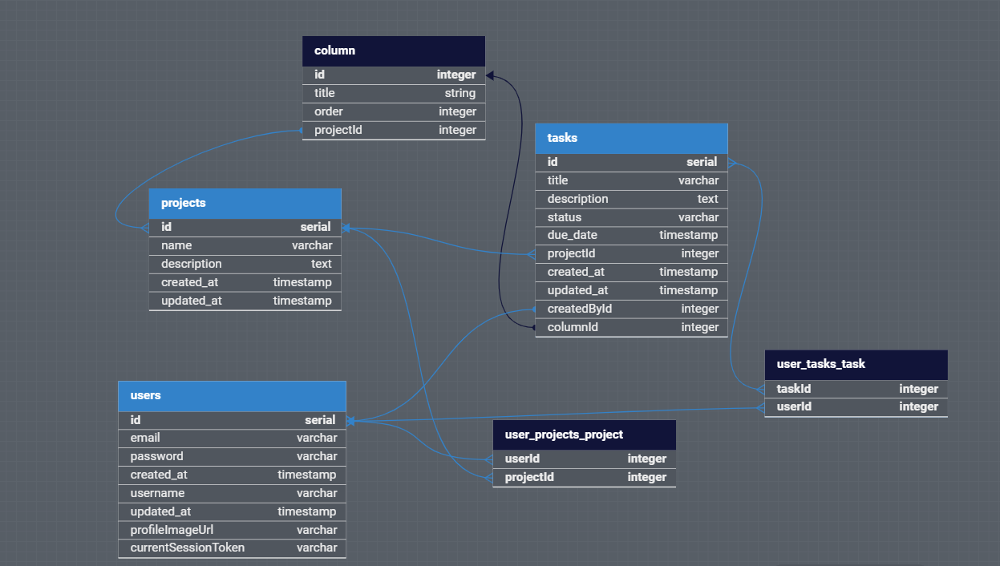
</p>

---

### 🚀 DevOps

- 
  Plataforma para desenvolvimento, envio e execução de aplicações em containers.

- 
  Ferramenta para definir e gerenciar multi-containers Docker.

- 
  Ferramenta de gerenciamento de banco de dados com uma interface de usuário amigável.

---

### 🎨 Design e Modelagem

- 
  Ferramenta online para modelagem de banco de dados ER.

- 
  Ferramenta para design de interface e prototipagem colaborativa.

## 📚 Aprendizados e erros cometidos no projeto

Durante o desenvolvimento deste projeto, adquiri conhecimentos valiosos em diversas áreas:

🔁 Dependência Circular

- Uma das lições mais significativas foi sobre dependências circulares. Esse problema ocorre quando duas ou mais entidades referenciam-se mutuamente, criando um ciclo. Isso pode causar dificuldades na manutenção, aumentar a complexidade do código e dificultar a compreensão do fluxo de dados.

- No projeto, encontrei dependências circulares entre as entidades User, Task e Project. Cada uma dessas entidades possui relações que acabam formando um loop. Abaixo estão os trechos de código que mostram esse comportamento:

### Entidade User

```typescript
@ManyToMany(() => Project, project => project.users)
projects: Project[];

@ManyToMany(() => Task, task => task.users)
tasks: Task[];

@OneToMany(() => Task, task => task.created_by)
tasks_created: Task[];
```

### Entidade Task

```typescript
@ManyToOne(() => Project, project => project.tasks)
project: Project;

@ManyToMany(() => User, user => user.tasks)
users: User[];

@ManyToOne(() => User, user => user.tasks_created)
created_by: User;

@ManyToOne(() => KanbanColumn, column => column.tasks)
column: KanbanColumn;
```

### Entidade Project

```typescript
@ManyToMany(() => User, (user) => user.projects)
users: User[];

@OneToMany(() => Task, task => task.project)
tasks: Task[];

@OneToMany(() => KanbanColumn, column => column.project)
columns: KanbanColumn[];
```

- Essas inter-relações criam um ciclo de dependência, onde as entidades User, Task e Project dependem umas das outras. Por exemplo, Task depende de User para saber quem criou a tarefa, enquanto User depende de Task para armazenar as tarefas criadas. O mesmo ocorre com Project, que está relacionado tanto a Task quanto a User. Essas dependências circulares podem tornar o código difícil de entender, testar e manter.

📊 Análise de Banco de Dados

- Compreendi melhor como projetar uma modelagem de banco de dados eficiente, garantindo que as relações entre entidades fossem bem planejadas e otimizadas.

🔐 Criptografia Simétrica

- Criptografia para mascarar IDs nas URLs do Kanban, melhorando a privacidade e segurança das informações sensíveis.

🛡 JWT (JSON Web Tokens)

- Estudei o uso de JWTs e entendi que é fundamental não armazenar tokens no localStorage por questões de segurança. Além disso, passarei a evitar a inclusão de dados sensíveis no payload do token.

🏗 Planejamento de Arquitetura

- Aprendi a importância de um planejamento detalhado da arquitetura da aplicação, incluindo a interface de usuário no frontend e o fluxo de dados entre backend e frontend.

🔍 Validação de Entrada de Dados

- Validações robustas para garantir a integridade dos dados e prevenir falhas causadas por entradas incorretas.

🚀 Performance de Aplicações

- Explorei técnicas para otimizar a performance da aplicação, como o uso de cache e uma gestão eficiente de sessões de usuário.

🛠 Integração Contínua

- Configurei ambiente de desenvolvimento com Docker, o que facilitou o trabalho e a entrega contínua de novas funcionalidades.

Estou continuamente aprendendo e adaptando as melhores práticas para aplicar futuramente em cada etapa do desenvolvimento que tiver em projetos futuros.

## Funcionalidades

- [x] Autenticação e autorização de usuários na manipulação das tarefas de projetos
- [x] CRUD de tarefas
- [x] Gestão de projetos
- [x] Kanban para visualização das tarefas
- [x] Refatoração do backend para funcionamento de autenticação de usuários por JWT
- [x] Implementação de validação de dados para evitar erros de entrada de dados
- [x] Compartilhamento de projetos entre usuarios do sistema
- [x] Funcionalidade de alterar imagem do usuario na edição do perfil

## Estrutura do Projeto

- backend/: API NestJS
- frontend/: Aplicação React.js
- database/: Configuração do PostgreSQL

## Como Executar o Projeto

### Pré-requisitos

- Docker
- Docker Compose

### Passos para Clonar e Configurar

```bash
git clone https://github.com/Sub-Dev/task-management-app.git
cd task-management-app
cd frontend
npm install
cd backend
npm install
```

Lembrar de altera o arquivo .env.example para .env e com os dados necessarios na pasta de backend. 😊

### Instruções para Executar com Docker

```bash
docker-compose up --build
```

## Acessar o Adminer

Depois que o Docker Compose estiver em execução, você pode acessar o Adminer para gerenciar seu banco de dados PostgreSQL navegando até:

```bash
http://localhost:8080
```

## Endpoints da API

A API estará disponível em:

```bash
http://localhost:4000
```

## Swagger

E o Swagger estará disponível em:

```bash
http://localhost:4000/api-docs
```

<p align="center">
  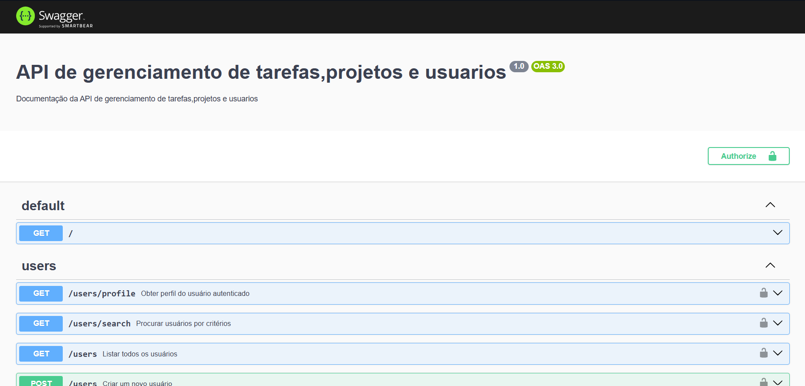
</p>

## Aplicação Frontend

A aplicação frontend estará disponível em:

```bash
http://localhost:3000
```

## 👥 Autor

<table>
 <tr>
 <td alinhar="centro">
 <a href="https://github.com/Sub-Dev" target="_blank">
 
 </a>
 </td>
 <td>
 <strong>Anthony Marin</strong> (Sub-Dev) - <a href="https://github.com/Sub-Dev">Perfil no GitHub</a>
 </td>
 </tr>
</table>

## Mais Imagens do Projeto

<table>
  <tr>
   <td></td>  
  <td></td>
  <td>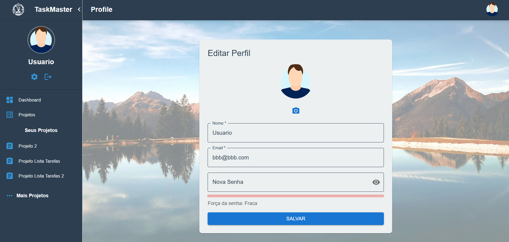</td>
  <td></td>
  <td></td>
  <td></td>
  <td></td>
  </tr>
</table>

## Mais Imagens do Projeto Tela Home Page

<table>
  <tr>
  <td>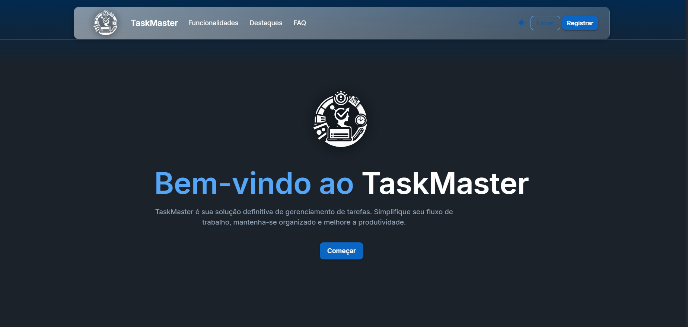</td>
  <td>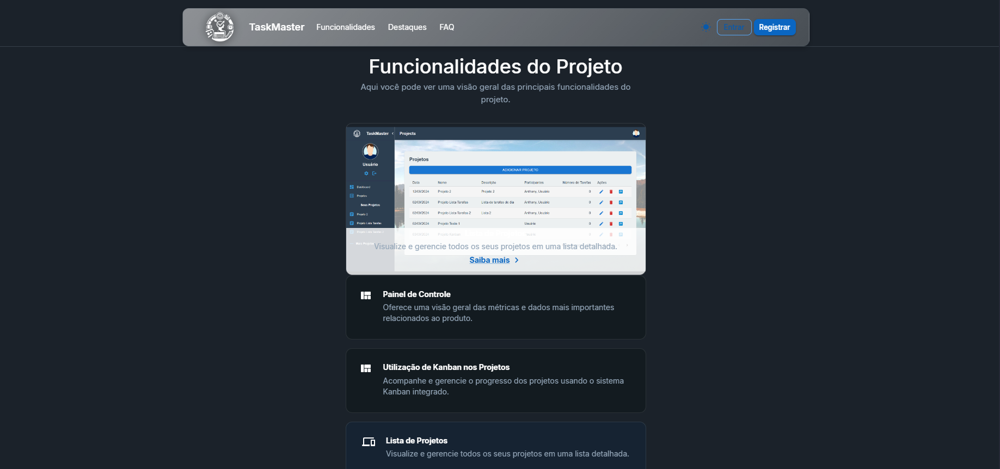</td>
  <td>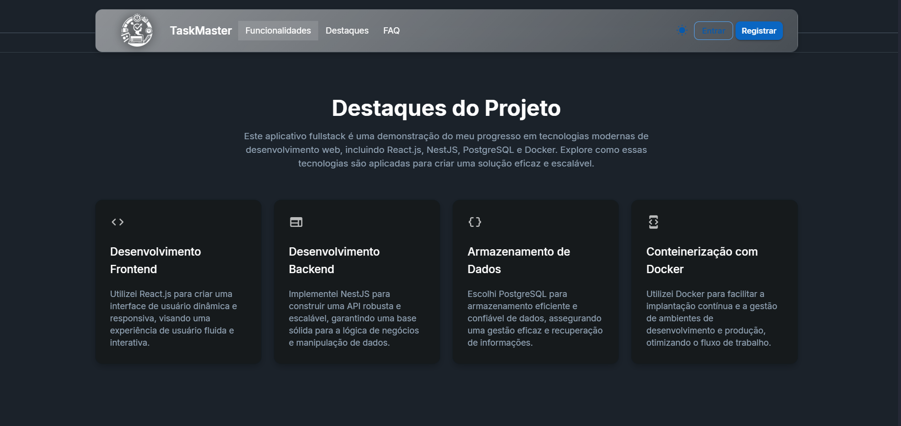</td>
  <td>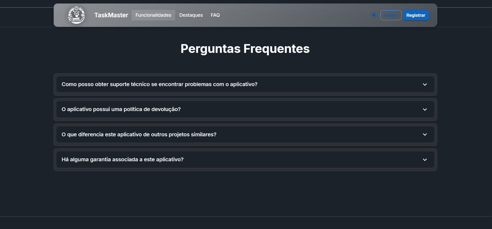</td>
  <td>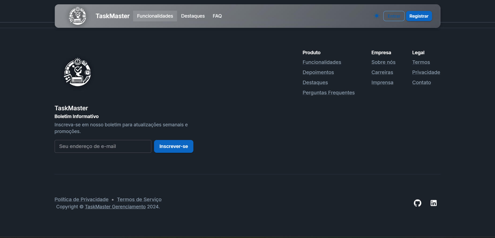</td>
  </tr>
</table>

## Licença

Este projeto está licenciado sob a Licença MIT.
